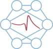

# Activation Functions - Augmenting activation functions
This framework reimplement activation functions with plotting capacities.

## 1. About Activation Functions

Activation functions package implement classic and novel activation functions. 
